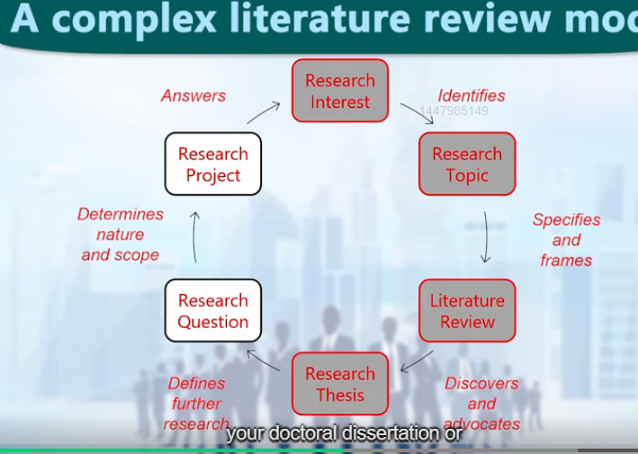
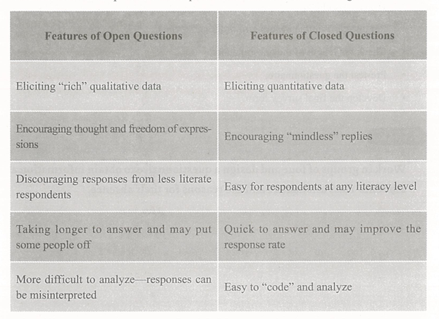

## Academic Writing U1
### language register
- static
- formal 
- consultative
- casual 
- personal
### formal features
- is more objective;
- is more complex;
- has a more formal structure;
- passive voice;
- third person;
- nominalization;
- uses more referencing.
### type 
- essay;
- thesis/dissertation;
- proposal;
- research paper;
### expression
- single verbs
- avoid contractions
- avoid "you"
- no direct questions
- no "etc"
- formal negative forms
- linking words
  
## U2 Introduction&Literature Review
an arguement that presents a case based on a comprehensive understanding of the current state of knowledge in a field of study.  
critical analysis  
Dg)

- thematicaL 
- chronological
- methodological
- theroetical

### complex model&simple model

pattern turning point key debates
### reporting verbs
a word which is used to talk about or report on other people's work.

indicate:
-the author's personal opinion
-the author's viewpoint regarding other literature
-your viewpoint regarding what the author say
#### function&strength

- neutral:without value judgement
- tentative:inclination to believe something,but not certain
- strong:strong belief&absolute confidence

| Function and strength                                                                                                                                             | Example verbs                                                                                                                                                                                                       |
| ----------------------------------------------------------------------------------------------------------------------------------------------------------------- | ------------------------------------------------------------------------------------------------------------------------------------------------------------------------------------------------------------------- |
| **NEUTRAL**: verbs used to say what the writer describes in factual terms, demonstrates, refers to, and discusses, and verbs used to explain his/her methodology. | describe, show, reveal, study, demonstrate, note, point out, indicate, report, observe, assume, take into consideration, examine, go on to say that, state, believe (unless this is a strong belief), mention, etc. |
| **TENTATIVE**: verbs used to say what the writer suggests or speculates on (without being absolutely certain).                                                    | suggest, speculate, intimate, hypothesize, moot, imply, propose, recommend, posit the view that, question the view that, postulate, etc.                                                                            |
| **STRONG**: verbs used to say what the writer makes strong arguments and claims for.                                                                              | argue, claim, emphasize, contend, maintain, assert, theorize, support the view that, deny, negate, refute, reject, challenge, strongly believe that, counter the view/argument that, etc.                           |

### tense

- present simple:establishing facts
- present perfect:ongoing.past simple can not be used
- past simple:completely finish actions.the year of publication is stated within the main sentence

* **Simple present tense**
  Authors mostly use the simple present tense verbs to cite other authors’ ideas, relate what other authors say or discuss the literature, theoretical concepts, methods, etc. For example:

  ▪ *When it comes to technology, King states* that we “need to be comfortable enough with technology tools and services so that we can help point our patrons in the right direction, even if we aren’t intimately familiar with how the device works” (11).

* **Simple past tense**
  When you use the past tense, the reporting verb often occurs as an integral citation. In other words, citations with past tense verbs and named researchers as subject seem to have the discourse role of providing particulars for recounting events, results found or a preceding generalization, or the basis for a claim, etc. Common verbs in the past tense are *investigated, studied, compared, analyzed, found,* and *examined.* In the example below, the citation reports the results of a single study.

  ▪ *Carlson and Benton (2007) found* that as they increased the participants’ stress levels, the results of their performance deteriorated.

* **Present perfect tense**
  The present perfect tense can be used to state that the research results are recent, expressing what has been found over an extended period in the past and up to the present to highlight the direct relevance of previous studies to the writer’s own research. For example:

  ▪ *Although the results of previous studies showed* that further research was warranted in this area, *recent studies have demonstrated* that educational methodology is now moving in a new direction (Jones, 2007; Karstal, 2008).

### citing

* **Information prominent citation**: Shrinking markets are also evident in other areas.
  The wool industry is experiencing difficulties related to falling demand worldwide since the development of high-quality synthetic fibers (Smith, 2000).

* **Author prominent citation**: Shrinking markets are also evident in other areas. As Smith (2000) pointed out, the wool industry was experiencing difficulties related to falling demand worldwide since the development of high-quality synthetic fibers. However, Jones et al. (2004) found that industry difficulties were more related to quality of supply than to demand issues. It is clear that considerable disagreement exists about the underlying sources of these problems.

* **Weak author prominent citation**: Several authors have reported that the wool industry is experiencing difficulties related to falling demand since the development of high-quality synthetic fibers (Nguyen, 2005; Smith, 2000; Wilson, 2003).

## Methodology

### A. Identifying Information Elements

A well-organized, logically ordered and understandable method section can make your paper or thesis a really outstanding work. Normally, a method section includes the following information elements:

- Overview of the research/Objective: a brief description about what has been done;
- Subjects: the people/subjects studied, or the things tested;
- Location: where a research takes place;
- Restrictions/Limiting conditions: precautions taken to make sure that the data is valid;
- Sampling techniques: describing how the subjects are selected for research;
- Materials: the materials used to conduct a study or an experiment;
- Procedure: the steps of conducting the research in a chronological order;
- Statistical treatment/Data analysis: describing how the statistics are examined.

Of all the information elements mentioned above, the only items that are always included in the method section are materials and procedure.

---
### passive voice
The passive voice is widely used in academic writing, because passive structures **have less subjective coloring** in most cases than active ones. When you describe a process or a scientific experiment, it is important to write in a neutral style, as an observer. To do this, you can use the passive voice. There are three instances in which the passive voice is recommended:
- i) when you do not know or do not care about who has performed the action;
- ii) when you focus on the receiver instead of the performer of the action; 
- iii) when you would like to remain in a neutral or objective position in writing.
### sequential markers
easy
### questionnaire
The design of a questionnaire depends on whether the researcher wishes to collect qualitative information  or quantitative information.

A good questionnaire is one that:
- i) enables you to collect accurate data effectively; 
- ii) facilitates data collecting, data processing, and data tabulating; 
- iii) ensures that there is no collection of non-essential information; 
- iv) permits comprehensive and meaningful analysis as well as purposeful utilization of the data collected.

There are many different types of questions you can use to get the information that you need. In general, they fall into open and closed questions. 

  

The following are eight steps involved in designing a questionnaire:
- Determine the information required;
- Define the target respondents;
- Choose the method(s) of reaching your target respondents;
- Design questions;
- Put questions into a meaningful order and format;
- Check the length of the questionnaire;
- Pre-test the questionnaire;
- Develop the final survey form.
## Results
the order of the results should be the same as the order of the methods

### graphic description

### data comparison and contrast
show similarity and difference
- block
- alternating

## Discussion

The discussion section of a research paper focuses on making claims and then adding support for those claims. 

What are claims? Claims are statements about ideas and data from you and other people.
### structure
7 elements
-
### how to begin

- remind reader of your goals
- Refer back to the questions you asked in the introduction
- Refer back to paper your cited in literature review
- Briefly summarize the results

### How to compare my work with those of others

- Make a general statement regarding your findings
- Mention another author's work that relates directly to your findings
- Make a link between her/his work and your work
- Clearly state how your work differs from her/his work
- State the conclusions that can be drawn from your results in light of these considerations
### how to end

### causes and effects

### strength and weak claim
strength claim: the claim is supported by strong evidence and is likely to be true.
| 类别  | 词汇                                                                                                                 |
| --- | ------------------------------------------------------------------------------------------------------------------ |
| 名词  | certainty; evidence                                                                                                |
| 动词  | show; prove; establish; confirm; conclude; determine                                                               |
| 形容词 | key; central; crucial; basic; fundamental; major; principal; essential; significant                                |
| 副词  | very; pretty; quite; clearly; obviously; undoubtedly; certainly; indeed; inevitably; invariably; always; literally |

weak claim: the claim is supported by weak evidence and is less likely to be true.
| 类别 | 词汇                                                                                                              |
| -- | --------------------------------------------------------------------------------------------------------------- |
| 动词 | appear; argue; doubt; estimate; seen (as); seem; speculate; suggest                                             |
| 副词 | largely; likely; mainly; maybe; perhaps; possibly; probably; rather; relatively; seemingly; somewhat; sometimes |
### paraphrase

## Conclution 

## Publication 
### abstract
informative /structure
### keywords
disicipline/topic/method/Datasource (3-5) 
### References
IEEE style/APA style/MLA style
### Acknowledgements
two types:
- i) on dissertation:acknowledgements to people who have helped you in your research; 
- ii) one paper:acknowledgements to the funding body that has supported your research.
### submitting cover letter