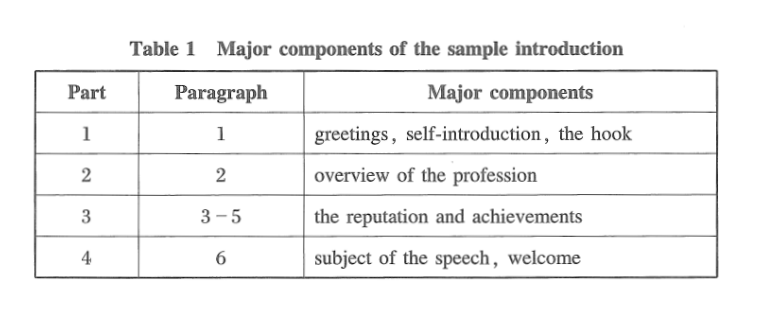

# introducing keynote speaker

## 组成部分Structure

### 1. Why is this subject important?
### 2. Why is this speaker invited?
### 3, Why does audience need to sit at the presentation ?
### 4. Why does the audience need to listen to the  speech right now?

### introduction
greeting ->self-intro->hook attantions
### body
### conclusion
Generak comment->reannounce of the name and title->topic->welcome

### example
Ladies and gentlemen, dear chairman Smith, distinguished guests,

Good morning, I'm Jessica Rich. First, I'd like to ask you a few questions. How many of you realize there are 5 scam phone calls every 5 minutes in the U.S.? How many of you know the loss of victims of scams could amount to trillions of dollars each year? Yes, everyone at this conference is a potential victim of a scam.

Now it is my pleasure to introduce our first keynote speaker for the day. We are so pleased that Illinois Attorney General Lisa Madigan has agreed to provide a keynote address at her third consecutive Midwest Region Common Ground Conference. She is just the one who was called The Safeguard of The People by the president last month.

As you know, Attorney General Madigan has been a national leader among the state Attorneys General in protecting consumers during the financial crisis. Under her leadership, the Consumer Protection Division of the Illinois Attorney General's Office has established a national reputation for aggressively safeguarding consumers from mortgage scams and other types of financial fraud.

During her nearly twelve years as the Illinois Attorney General, Lisa Madigan has also been a great friend of the FTC. Our Midwest Region office in Chicago, for example, recently teamed with Attorney General Madigan's Office, and the AGs of Kentucky and North Carolina, to take down Fortune Hi-Tech Marketing, a massive pyramid scheme that operated throughout the country, particularly targeting immigrant and Spanish-speaking communities. I'm happy to report that earlier this week, a federal district judge in Kentucky approved a settlement in that case that will divest the defendants of much of their wealth and provide for almost $8 million in restitution to the scheme's victims.

That case is just one of many examples of the cooperative relationship the FTC has enjoyed with Attorney General Madigan's office. As part of our Chicago Fraud Task Force, we jointly plan enforcement and consumer education initiatives, including our extremely popular Shred Day event at Chicago's United Center. After the adoption of the FTC's MARS Rule, we teamed with Attorney General Madigan's Office and the Illinois Attorney Registration & Disciplinary Commission to address the problem of attorneys fronting for MARS providers in order to circumvent the Rule's ban on up-front payments. Attorney General Madigan then brought some of the first cases in the country against attorneys playing that role.

She clearly is at the forefront of the consumer protection community. I'm proud to introduce Illinois Attorney General Lisa Madigan. She is going to talk about the challenges we are facing in the next decade. Please join me in welcoming Lisa Madigan.

### output_2
**Introduction for Keynote Speakers at an Academic Meeting on AI Application**

---

**Greeting:**

Ladies and gentlemen, dear Chairman Smith, distinguished guests,

Good morning, and welcome to this exciting academic gathering!I am Congzhe Chi. We are thrilled to have you all here today as we explore one of the most transformative fields of the 21st century – **Artificial Intelligence (AI) Application**.How do we ensure AI is developed and deployed in ways that benefit everyone? How can we make AI systems more transparent, ethical, and inclusive? Today’s keynote speakers will help us explore these questions and more, offering a deeper dive into the ways AI can be applied to tackle real-world challenges.

**Body:**

Now, it is my great pleasure to introduce our first keynote speaker of the day.

---

### **Keynote Speaker 1:**

**[Speaker_1]**, [Speaker_1 Title] at SouthEast University, is a leading expert in **AI and Healthcare**. Over the past decade, [Speaker’s Name] has been at the forefront of developing AI-powered solutions aimed at improving patient outcomes, optimizing hospital systems, and advancing personalized medicine. Their groundbreaking work in **medical imaging** and **predictive analytics** has earned them numerous awards, including the prestigious [Award Name].

Today, [Speaker_1] will discuss their latest research on **AI in Precision Medicine**, shedding light on how AI can be harnessed to deliver highly individualized treatment plans for patients with complex medical conditions. Their presentation will also cover the ethical considerations involved in using AI in healthcare and the ways we can ensure patient data privacy while fostering innovation.

Please join me in welcoming **[Speaker_1]**, [Speaker_1 Title] .

---

### **Keynote Speaker 2:**

Our next keynote speaker, **[Speaker's Name]**, [Speaker’s Title] at SouthEast University, is an expert in **AI and Ethics**, with a focus on **fairness, accountability, and transparency** in AI systems. With a background in both **computer science** and **philosophy**, [Speaker’s Name] has spent years researching how to build AI systems that are not only efficient but also just, equitable, and explainable.

In their talk, titled **"AI for Good: Balancing Innovation with Ethical Responsibility"**, [Speaker’s Name] will explore how we can address the growing concerns around bias and fairness in AI applications, particularly in sensitive areas like criminal justice, hiring, and lending. Their research advocates for the creation of **ethical frameworks** that can guide AI development in a way that ensures it serves society as a whole, rather than reinforcing existing inequalities.

Please join me in welcoming **[Speaker’s Name]**, [Speaker’s Title].

---

### **Keynote Speaker 3:**

Finally, it is my pleasure to introduce **[Speaker’s Name]**, [Speaker’s Title] atSouthEast University, who is renowned for their work in **AI and Environmental Sustainability**. [Speaker’s Name] has led several high-impact projects using AI to address climate change, including developing intelligent systems to optimize energy usage, reduce carbon emissions, and monitor environmental changes in real time.

In their keynote, **"[Title of Keynote Speech]"**, [Speaker’s Name] will discuss how AI can be leveraged to create a **sustainable future**, particularly focusing on the role of AI in **renewable energy**, **smart cities**, and **climate modeling**. As the world faces an urgent need for innovative solutions to the climate crisis, [Speaker’s Name] will highlight how AI can help us meet our sustainability goals while balancing environmental, social, and economic needs.

Please join me in welcoming **[Speaker’s Name]**, [Speaker’s Title].

---

**Conclusion:**

We are in for an incredibly insightful day as we hear from these three outstanding experts, each of whom is shaping the future of AI in profound ways. Their talks will challenge us to think critically about the power of AI, its potential applications, and the responsibilities we bear as we continue to push the boundaries of innovation.

I encourage you all to engage actively in today’s discussions, as it is your contributions that will help us shape a future where AI is applied thoughtfully, ethically, and equitably.

Please join me once again in welcoming **[Speaker’s Name]**, [Speaker’s Title] , **[Speaker’s Name]**, [Speaker’s Title] , **[Speaker’s Name]**, [Speaker’s Title] . Let’s give them a warm round of applause!

---
## 返回意见
这篇演讲稿总体正式、流畅，结构清晰，但是我觉得略微有些长，部分内容可以精简一下，肯定是超时了。
以下是针对具体内容的一些小建议，仅供参考，不参考也行：
1.诸如 "Please join me in welcoming [SpeakerX], [Title]" 的重复使用稍显单调，可以在每次介绍后使用不同的表达方式，例如 "Let us warmly welcome..." 或 "It is with great pleasure that we welcome..."

2.结尾可以更具体地总结三位演讲嘉宾的主题，而非仅笼统提及 AI 的潜力。例如：  
"From precision medicine to ethical frameworks and environmental sustainability, today’s talks will guide us in envisioning how AI can address complex global challenges while maintaining human-centered values."*

3.建议在鼓励听众参与时更具体，例如： "Feel free to ask questions during the Q&A sessions or connect with our speakers during the networking breaks to exchange ideas and insights."
## 修改稿