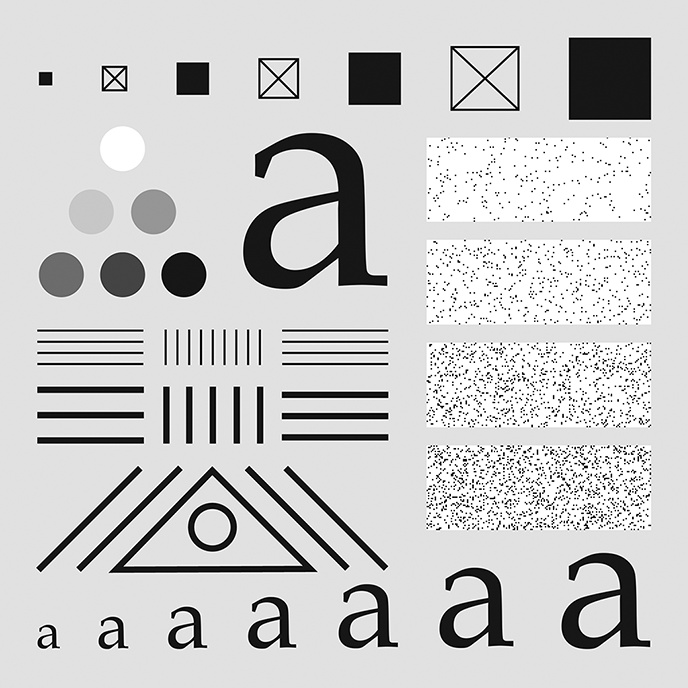
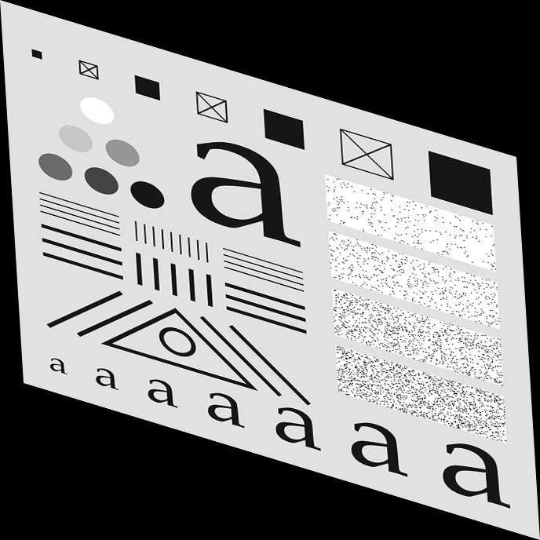
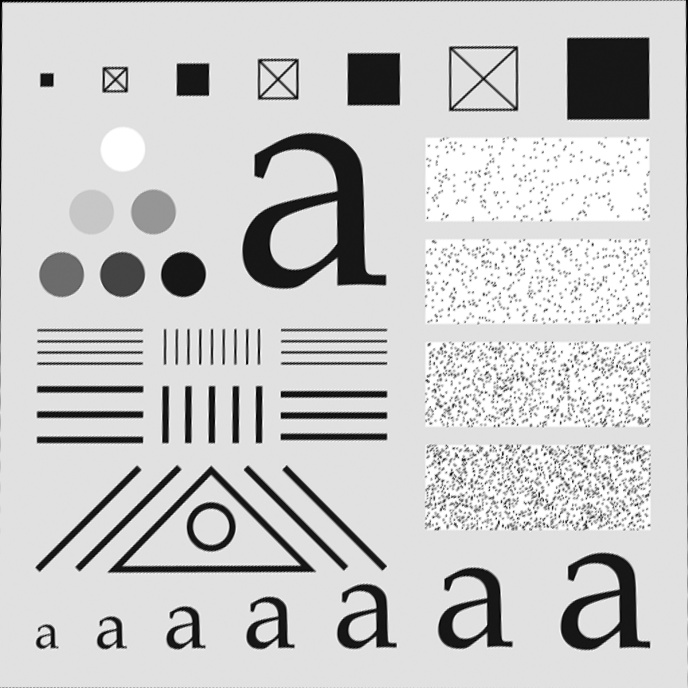
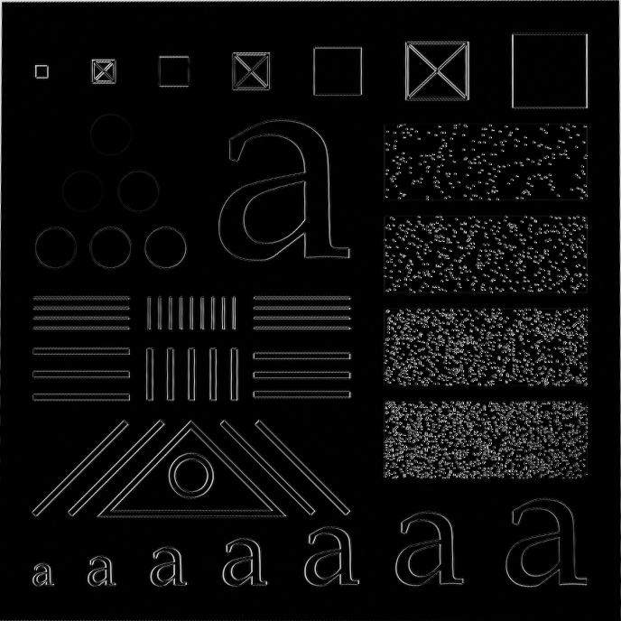

# 数字图像处理第一次作业
池聪哲 220246458
## 调研
### 图像配准
图像配准是计算机视觉和图像处理中的一个重要任务，它涉及将两幅或多幅图像在空间上对齐，以便它们对应的特征点或特征区域能够重合。图像配准的方法可以大致分为以下几种：

1. **基于特征的配准**：
   - 这种方法首先提取图像的特征点，然后生成特征描述子，最后根据描述子的相似程度对两幅图像的特征之间进行匹配。常用的特征点检测算法包括SIFT（尺度不变特征变换）、SURF（加速稳健特征）、ORB（Oriented FAST and Rotated BRIEF）、Harris角点检测等。这些特征点对图像的灰度变化具有鲁棒性，但对特征提取和匹配的精度要求较高。

2. **基于灰度的配准**：
   - 直接法是一种基于图像像素值的配准方法，它通过最小化两幅图像之间的像素值差异来确定最佳的变换参数。这种方法适用于图像之间的灰度变化较小的情况，常用的直接法配准算法有互信息（Mutual Information）和归一化互相关（Normalized Cross-Correlation）等。

3. **基于域变换的配准**：
   - 这类方法通常使用傅里叶变换为基础，进行频域内的配准。傅里叶变换能够用于具有平移、旋转、缩放的图像配准中，因为它在变换域内可以保持这些属性。

4. **基于优化的配准**：
   - 传统的配准方法是一个迭代优化的过程，首先定义一个相似性度量（如：L2范数，互信息），通过对参数变换或非参变换进行不断迭代优化，使得配准后的源图像与目标图像相似度最大。

5. **基于深度学习的配准**：
   - 近年来，深度学习方法在图像配准领域也取得了显著的进展。这些方法通常涉及使用卷积神经网络（CNN）来学习图像特征，然后使用这些特征进行配准。深度学习方法能够处理复杂的变换，包括非刚性变换。

图像配准的应用非常广泛，包括医学图像处理（如CT、MRI图像的配准）、卫星图像分析、目标跟踪、三维重建等领域。在实际应用中，图像配准面临的挑战包括图像质量、大规模图像配准、多模态图像配准等。图像配准的质量评估也是一个重要的研究领域，常用的评估标准包括相关性（Correlation Coefficient, CC）和互信息（Mutual Information, MI）。
## 矩阵求解
在图像处理中，线性变换通常涉及到仿射变换（Affine Transformation），它可以通过一个变换矩阵来表示。如果你有一组对应的点（在变换前后），你可以使用这些点来求解变换矩阵。

假设你有以下四对点：\( (x_1, y_1) \) 和 \( (x_1', y_1') \)，\( (x_2, y_2) \) 和 \( (x_2', y_2') \)，\( (x_3, y_3) \) 和 \( (x_3', y_3') \)，\( (x_4, y_4) \) 和 \( (x_4', y_4') \)。其中，\( (x_i, y_i) \) 是原始图像中的点，而 \( (x_i', y_i') \) 是变换后图像中的对应点。

仿射变换矩阵 \( A \) 通常表示为：
\[ A = \begin{bmatrix} a & b & c \\ d & e & f \end{bmatrix} \]

对于任意点 \( (x, y) \)，变换后的点 \( (x', y') \) 可以通过下面的方程计算：
\[ \begin{bmatrix} x' \\ y' \end{bmatrix} = A \begin{bmatrix} x \\ y \end{bmatrix} = \begin{bmatrix} a & b & c \\ d & e & f \end{bmatrix} \begin{bmatrix} x \\ y \\ 1 \end{bmatrix} \]

这可以展开为两个方程：
\[ x' = ax + by + c \]
\[ y' = dx + ey + f \]

为了求解矩阵 \( A \)，你需要解一个线性方程组。对于每一对点，你将得到两个方程，因此四对点将给你八个方程。你可以将这些方程写成矩阵形式并求解。

首先，构建增广矩阵：
\[ \begin{bmatrix}
x_1 & y_1 & 1 & -1 & 0 & 0 & -x_1'x_1 & -x_1'y_1 \\
x_2 & y_2 & 1 & 0 & -1 & 0 & -x_2'x_2 & -x_2'y_2 \\
x_3 & y_3 & 1 & 0 & 0 & -1 & -x_3'x_3 & -x_3'y_3 \\
x_4 & y_4 & 1 & -1 & 0 & 0 & -x_4'x_4 & -x_4'y_4 \\
\end{bmatrix} \]

然后，你可以使用线性代数的方法（如高斯消元法、矩阵求逆等）来求解这个方程组，得到 \( a, b, c, d, e, f \) 的值。
## 作业 例2-10
### 原图像
选择了四个约束点

进行透视变换
```python
# 获取图像尺寸
height, width = img.shape[:2]
# 定义原始图像的四个角点
pts1 = np.float32([[0, 0], [width, 0], [0, height], [width, height]])
# 右上角向左下偏移，左下角向右上偏移
pts2 = np.float32([[0, 0], [width - 30, 200], [30, height - 200], [width, height]])
# 计算透视变换矩阵
M = cv2.getPerspectiveTransform(pts1, pts2)
# 透视变换
img_T= cv2.warpPerspective(img, M, (width, height))
```  
变换图像

确定原图像和变换图像约束点坐标(8个)
```python
## 选点函数
def select_points(img):
    cv2.imshow('Select 4 Points', img)
    cv2.setMouseCallback('Select 4 Points', get_mouse_click)
    # 等待用户点击四个点
    cv2.waitKey(0)
    # 输出点击的点坐标
    print("Selected Points:", points)
    # 等待并关闭所有窗口
    cv2.destroyAllWindows()
Point 1: (39, 72)
Point 2: (650, 36)
Point 3: (39, 629)
Point 4: (573, 580)
Point 5: (39, 61)
Point 6: (625, 215)
Point 7: (66, 458)
Point 8: (574, 578)
```
求解方程计算配准变换矩阵，并进行变换
```python
# 对应的四个点，分别是左上、右上、左下、右下
pts1 = np.float32([[39, 72], [650, 36], [39, 629], [573, 580]])  # 变换前图像约束点
pts2 = np.float32([[39, 61], [625, 215], [66, 458], [574, 578]])  # 变换后图像约束点
# 计算透视变换矩阵
M = cv2.getPerspectiveTransform(pts2, pts1)
# 对右上角图像进行透视变换，使其与左上角图像对齐
aligned_image = cv2.warpPerspective(img_T, M, (img.shape[1], img.shape[0]))
```
配准后图像

作差看误差
```python
# 计算两幅图像的像素差异
diff_image = cv2.absdiff(img, aligned_image)
```
误差图像
