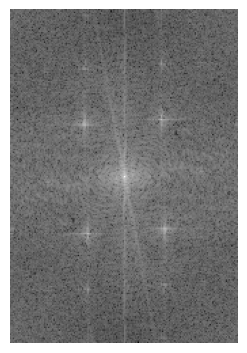
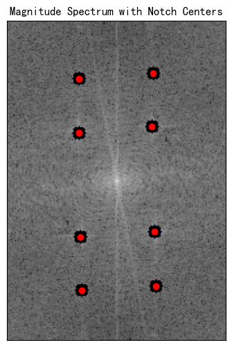
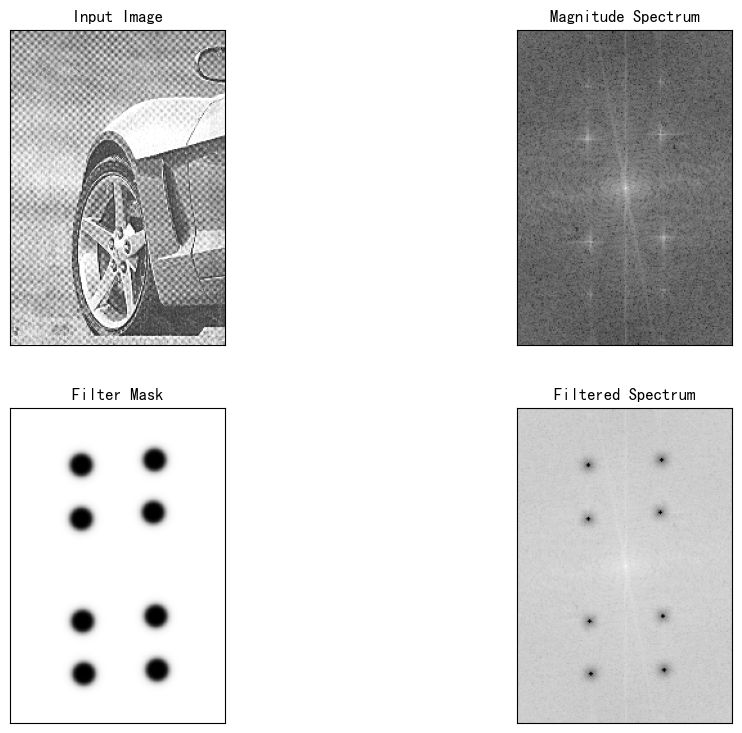
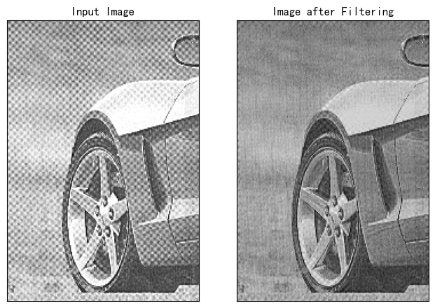

# 池聪哲-246458-作业3
```python
import cv2
import numpy as np
import matplotlib.pyplot as plt

# 读取图像
img = cv2.imread(r'D:homework\pic-pro\hw3\car-moire-pattern.tif', cv2.IMREAD_GRAYSCALE)

# 获取图像尺寸
rows, cols = img.shape
print(f"Rows: {rows}, Cols: {cols}")

# 应用傅里叶变换
dft = cv2.dft(np.float32(img), flags=cv2.DFT_COMPLEX_OUTPUT)
dft_shift = np.fft.fftshift(dft)  # 移动频谱中心到图像中心

# 计算幅度谱
magnitude_spectrum = 20 * np.log(cv2.magnitude(dft_shift[:, :, 0], dft_shift[:, :, 1]))

# 归一化幅度谱
magnitude_spectrum_normalized = cv2.normalize(magnitude_spectrum, None, 0, 255, cv2.NORM_MINMAX)

# 转换为8位无符号整型
magnitude_spectrum_8u = cv2.convertScaleAbs(magnitude_spectrum_normalized)

# 使用matplotlib显示幅度谱
plt.figure(figsize=(10, 5))
plt.subplot(132), plt.imshow(magnitude_spectrum_8u, cmap='gray')
plt.axis('off')
```

```python
# 用于存储点击的点的坐标
noise_centers = []

# 鼠标回调函数，用于记录点击位置
def get_mouse_click(event, x, y, flags, param):
    if event == cv2.EVENT_LBUTTONDOWN:  # 检测到鼠标左键点击
        noise_centers.append((y, x))  # 保存坐标
        print(f"Point {len(noise_centers)}: ({y}, {x})")
        # 在图像上绘制点击的点
        cv2.circle(param, (x, y), 5, (0, 0, 255), -1)
        cv2.imshow('Select Points', param)
        if len(noise_centers) == 8:  # 当点击八个点后，自动退出
            cv2.destroyAllWindows()
 # 显示图像，并设置鼠标回调函数
cv2.imshow('Select Points', magnitude_spectrum_8u)
cv2.setMouseCallback('Select Points', get_mouse_click, magnitude_spectrum_8u)

# 等待用户点击八个点
cv2.waitKey(0)

# 输出点击的点坐标
print("Selected Points:", noise_centers)

# 等待并关闭所有窗口
cv2.destroyAllWindows()           
```
Point 1: (44, 55)
Point 2: (40, 112)
Point 3: (81, 111)
Point 4: (86, 55)
Point 5: (166, 56)
Point 6: (162, 113)
Point 7: (207, 57)
Point 8: (204, 114)
Selected Points: [(44, 55), (40, 112), (81, 111), (86, 55), (166, 56), (162, 113), (207, 57), (204, 114)]
```python
# 在频谱图上标记陷波中心
plt.figure(figsize=(6, 6))
plt.imshow(magnitude_spectrum_8u, cmap='gray')
plt.title('Magnitude Spectrum with Notch Centers')

# 绘制红点标记陷波中心
for center in noise_centers:
    plt.scatter(center[1], center[0], color='red')  # 注意：matplotlib的坐标系与OpenCV的坐标系不同

plt.xticks([]), plt.yticks([])
plt.show()
```

```python
# 巴特沃斯陷波带阻滤波器函数
def butterworth_bandstop_filter(shape, center, D0, n):
    rows, cols = shape
    mask = np.ones((rows, cols), np.float32)  # 初始化为全1（白色）
    for i in range(rows):
        for j in range(cols):
            distance = np.sqrt((i - center[0])**2 + (j - center[1])**2)
            # 巴特沃斯滤波器公式
            mask[i, j] = 1 / (1 + (distance / D0)**(2 * n))
    return 1-mask

# 设定陷波参数
D0 = 9
n = 4
# 创建滤波器掩模
mask = np.ones((rows, cols, 2), np.float32)  # 初始化为全1（白色），形状为 (rows, cols, 2)
for center in noise_centers:
    new_mask = butterworth_bandstop_filter((rows, cols), center, D0, n)
    new_mask = new_mask[..., np.newaxis]  # 将 new_mask 扩展为 (rows, cols, 1)
    
    # 使用逐元素相乘来组合掩膜，扩展后的 new_mask 变为 (rows, cols, 2)
    mask = np.multiply(mask, np.repeat(new_mask, 2, axis=-1))  # 将 new_mask 重复两次，沿第三轴


# 应用滤波器
fshift =dft_shift * mask  # 将掩模应用到频谱上

# 显示滤波器掩模与傅里叶变换结果相乘的效果
magnitude_spectrum_filtered = 20 * np.log(cv2.magnitude(fshift[:, :, 0], fshift[:, :, 1]) + 1e-10)

plt.figure(figsize=(12, 9))
plt.subplot(221), plt.imshow(img, cmap='gray')
plt.title('Input Image'), plt.xticks([]), plt.yticks([])
plt.subplot(222), plt.imshow(magnitude_spectrum, cmap='gray')
plt.title('Magnitude Spectrum'), plt.xticks([]), plt.yticks([])
plt.subplot(223), plt.imshow(mask[..., 0], cmap='gray')
plt.title('Filter Mask'), plt.xticks([]), plt.yticks([])
plt.subplot(224), plt.imshow(magnitude_spectrum_filtered, cmap='gray')
plt.title('Filtered Spectrum'), plt.xticks([]), plt.yticks([])
plt.show()
```

```python
# 逆傅里叶变换
f_ishift = np.fft.ifftshift(fshift)
img_back = cv2.idft(f_ishift)
img_back = cv2.magnitude(img_back[:, :, 0], img_back[:, :, 1])

# 使用matplotlib显示结果
plt.figure(figsize=(12, 6))
plt.subplot(131), plt.imshow(img, cmap='gray')
plt.title('Input Image'), plt.xticks([]), plt.yticks([])
plt.subplot(132), plt.imshow(img_back, cmap='gray')
plt.title('Image after Filtering'), plt.xticks([]), plt.yticks([])
plt.show()

```

## 调研
频域变换是一种常用于图像处理的技术，通过将图像从空间域（即像素级）转换到频域（即频率级）来进行分析和处理。频域变换主要使用傅里叶变换（Fourier Transform）及其变体，如离散傅里叶变换（DFT）和离散余弦变换（DCT）。频域分析可以帮助我们从不同的角度观察图像特征，许多经典的图像处理算法和应用都依赖于频域变换。

以下是一些经典的图像处理算法和案例，均使用频域变换实现：

### 1. **图像去噪（Noise Reduction）**
频域去噪是最常见的频域应用之一。噪声通常主要集中在高频区域，而图像的细节和边缘信息主要集中在中低频区域。通过过滤高频噪声，可以有效去除图像噪声。

- **低通滤波器（Low-pass Filtering）：** 低通滤波器在频域中允许低频信号通过，同时抑制高频噪声。常见的低通滤波器包括理想低通滤波器、高斯低通滤波器和巴特沃斯低通滤波器。
  
  **应用步骤：**
  1. 将图像转换到频域。
  2. 创建一个低通滤波器，抑制高频部分。
  3. 应用该滤波器，进行频域滤波。
  4. 将结果转换回空间域。

  **案例：** 使用高斯低通滤波器去除图像中的椒盐噪声或高频噪声。

  ```python
  import cv2
  import numpy as np
  import matplotlib.pyplot as plt

  # 读取图像并添加噪声
  img = cv2.imread('image.jpg', cv2.IMREAD_GRAYSCALE)
  rows, cols = img.shape

  # 添加高斯噪声
  noise = np.random.normal(0, 25, (rows, cols))
  img_noisy = np.uint8(np.clip(img + noise, 0, 255))

  # 应用傅里叶变换
  dft = cv2.dft(np.float32(img_noisy), flags=cv2.DFT_COMPLEX_OUTPUT)
  dft_shift = np.fft.fftshift(dft)
  # 创建高斯低通滤波器
  def gaussian_lowpass_filter(shape, D0):
      rows, cols = shape
      mask = np.zeros((rows, cols), np.float32)
      center = (rows // 2, cols // 2)
      for i in range(rows):
          for j in range(cols):
              D = np.sqrt((i - center[0]) ** 2 + (j - center[1]) ** 2)
              mask[i, j] = np.exp(-(D ** 2) / (2 * (D0 ** 2)))
      return mask
  D0 = 50  # 截止频率
  mask = gaussian_lowpass_filter(img.shape, D0)
  mask = mask[:, :, np.newaxis]  # 增加一个维度

  # 应用滤波器
  fshift_filtered = dft_shift * mask

  # 逆傅里叶变换
  f_ishift = np.fft.ifftshift(fshift_filtered)
  img_back = cv2.idft(f_ishift)
  img_back = cv2.magnitude(img_back[:, :, 0], img_back[:, :, 1])

  # 显示结果
  plt.figure(figsize=(10, 10))
  plt.subplot(131), plt.imshow(img_noisy, cmap='gray'), plt.title('Noisy Image')
  plt.subplot(132), plt.imshow(np.log(np.abs(dft_shift[:, :, 0]) + 1), cmap='gray'), plt.title('Magnitude Spectrum')
  plt.subplot(133), plt.imshow(img_back, cmap='gray'), plt.title('Filtered Image')
  plt.show()
  ```

### 2. **图像锐化（Sharpening）**
图像锐化可以增强图像中的细节和边缘。频域锐化通常通过应用高通滤波器来增强图像的高频部分。常见的高通滤波器包括理想高通滤波器、高斯高通滤波器和巴特沃斯高通滤波器。

- **高通滤波器（High-pass Filtering）：** 高通滤波器去除低频信息，只保留高频部分，通常用于锐化图像。

  **应用步骤：**
  1. 将图像转换到频域。
  2. 创建一个高通滤波器，抑制低频部分。
  3. 应用该滤波器，进行频域滤波。
  4. 将结果转换回空间域。

  **案例：** 使用高斯高通滤波器锐化图像。

  ```python
  def gaussian_highpass_filter(shape, D0):
      rows, cols = shape
      mask = np.ones((rows, cols), np.float32)
      center = (rows // 2, cols // 2)
      for i in range(rows):
          for j in range(cols):
              D = np.sqrt((i - center[0]) ** 2 + (j - center[1]) ** 2)
              mask[i, j] = 1 - np.exp(-(D ** 2) / (2 * (D0 ** 2)))
      return mask

  D0 = 50  # 截止频率
  mask = gaussian_highpass_filter(img.shape, D0)
  mask = mask[:, :, np.newaxis]  # 增加一个维度

  # 应用高通滤波器
  fshift_filtered = dft_shift * mask

  # 逆傅里叶变换
  f_ishift = np.fft.ifftshift(fshift_filtered)
  img_back = cv2.idft(f_ishift)
  img_back = cv2.magnitude(img_back[:, :, 0], img_back[:, :, 1])

  # 显示结果
  plt.figure(figsize=(10, 10))
  plt.subplot(131), plt.imshow(img, cmap='gray'), plt.title('Original Image')
  plt.subplot(132), plt.imshow(np.log(np.abs(dft_shift[:, :, 0]) + 1), cmap='gray'), plt.title('Magnitude Spectrum')
  plt.subplot(133), plt.imshow(img_back, cmap='gray'), plt.title('Sharpened Image')
  plt.show()
  ```

### 3. **图像压缩（Image Compression）**
离散余弦变换（DCT）常用于图像压缩，例如 JPEG 图像压缩。DCT 可以将图像数据从空间域转换到频域，使得大部分图像能量集中在低频部分，进而可以去除高频信息，达到压缩的效果。

- **DCT压缩：** 使用DCT对图像进行频域变换，然后丢弃低于某个阈值的高频系数，最后进行逆变换。

  **应用步骤：**
  1. 将图像转换到频域（使用 DCT）。
  2. 丢弃低频信息，保留最重要的频域系数。
  3. 使用逆 DCT 重建图像。

  **案例：** 使用 DCT 压缩图像。

  ```python
  def dct_2d(img):
      return cv2.dct(np.float32(img))

  def idct_2d(dct_img):
      return cv2.idct(dct_img)

  img = cv2.imread('image.jpg', cv2.IMREAD_GRAYSCALE)

  # 计算 DCT
  dct_img = dct_2d(img)

  # 保留前 30 个 DCT 系数
  dct_img[30:, :] = 0
  dct_img[:, 30:] = 0

  # 逆 DCT 重建图像
  img_compressed = idct_2d(dct_img)

  plt.figure(figsize=(10, 10))
  plt.subplot(131), plt.imshow(img, cmap='gray'), plt.title('Original Image')
  plt.subplot(132), plt.imshow(np.log(np.abs(dct_img) + 1), cmap='gray'), plt.title('DCT Spectrum')
  plt.subplot(133), plt.imshow(img_compressed, cmap='gray'), plt.title('Compressed Image')
  plt.show()
  ```

### 4. **图像特征提取与匹配**
通过频域变换，图像特征可以通过频率成分进行提取，例如在模式识别、物体检测和图像匹配中，频域可以帮助识别相似的图像特征。

- **频域特征提取：** 使用傅里叶变换提取图像的频域特征，进行模式匹配或对象检测。

### 总结：
频域变换（如傅里叶变换、离散傅里叶变换、离散余弦变换）在图像处理中的应用非常广泛，典型的应用包括图像去噪、锐化、压缩、特征提取等。通过在频

域中操作，我们能够高效地实现一些在空间域中较难处理的任务。