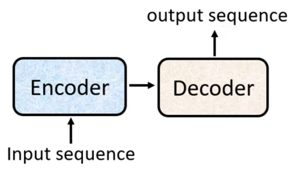
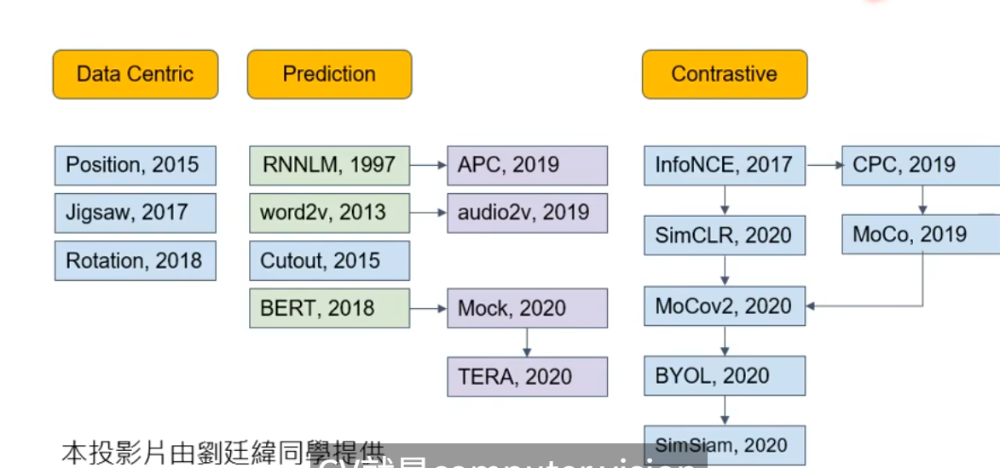
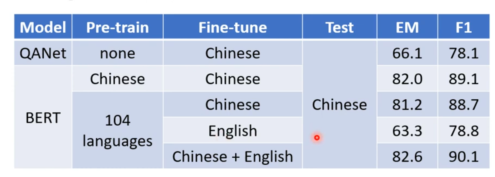
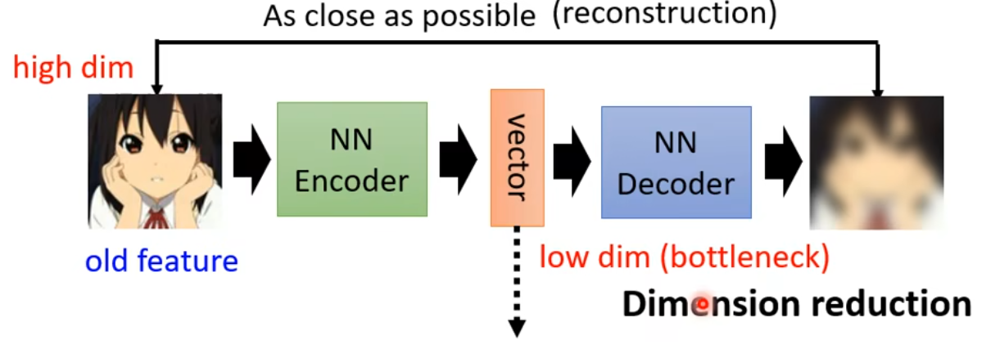
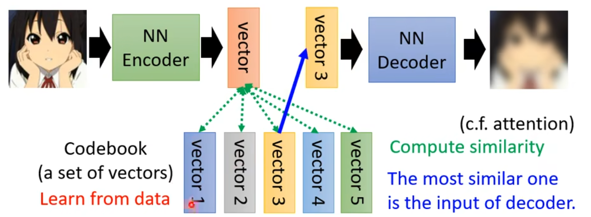

# regression
## linear regression
使用$\delta$ 函数实现特征选择
$$
\hat{y} = \sum_{i=1}^{n}\delta(x_i)w_i+b_i
$$
## regularization
表述我们要找的function参数值越接近0越好  
$$
L(y,\hat{y}) = \frac{1}{n}\sum_{i=1}^{n}(y_i-\hat{y}_i)^2 + \lambda\sum_{i=1}^{n}w_i^2
$$  

## loss
平均绝对误差(MAE)
$$
L(y,\hat{y}) = \frac{1}{n}\sum_{i=1}^{n}|y_i-\hat{y}_i|
$$

均方误差(MSE)  
$$
L(y,\hat{y}) = \frac{1}{n}\sum_{i=1}^{n}(y_i-\hat{y}_i)^2
$$

### learning rate
hyperparameter $\eta$  
$$
\hat{y}^{(t+1)} = \hat{y}^{(t)} - \eta \frac{\partial L(y,\hat{y})}{\partial \hat{y}}
$$

## optimization

### gradient descent
> 针对一个输入？还是针对所有输入？看Loss function，实践一个batch更新一次
$$
\hat{y}^{(t+1)} = \hat{y}^{(t)} - \eta \frac{\partial L(y,\hat{y})}{\partial \hat{y}}
$$
#### backword propagation
$$
\frac{\partial L(y,\hat{y})}{\partial \hat{y}} = \frac{\partial L(y,\hat{y})}{\partial z} \frac{\partial z}{\partial \hat{y}}
$$

# Classification
## binary
### Probabilistic generative model(统计模型)

$$
\begin{aligned}
P(y=1|x) &= \frac{P(x|y=1)P(y=1)}{P(x)}\\
&= \frac{P(x|y=1)P(y=1)}{P(x|y=1)P(y=1)+P(x|y=0)P(y=0)}\\
&=\frac{1}{1+e^{-z}},z=\ln\frac{P(x|y=1)P(y=1)}{P(x|y=0)P(y=0)}
\end{aligned}
$$
  
当共用协相关系数矩阵时,不限于Guussian分布，其他许多分布也能化简成这样的结果  
$$
z = w^Tx+b\\
P(y=1|x) = \sigma(w^Tx+b)
$$
所以sigmoid函数的输出的是posterior probability

- 生成模型的好处
  - 假设概率分布，需要的训练数据更少
  - 假设概率分布，对噪声更具鲁棒性
  - 先验和类别相关的概率可以从不同来源估计(important):可以更好的获得先验概率

### naive Bayes Classifier

### logistic regression(Discriminative model)

#### cross entropy
$$
L(y,\hat{y}) = -\sum_{i=1}^{n}y_i\ln(\hat{y}_i)+(1-y_i)\ln(1-\hat{y}_i)
$$

$$
L(y,\hat{y}) = -\sum_{i=1}^{n}y_i\ln(\hat{y}_i)
$$
## multi-class
### softmax
$$
\hat{y}_i = \frac{e^{z_i}}{\sum_{j=1}^{n}e^{z_j}}
$$

# Deep learning
## activation function
### sigmoid
$$
\sigma(x) = \frac{1}{1+e^{-x}}
$$
### tanh
$$
\tanh(x) = \frac{e^x-e^{-x}}{e^x+e^{-x}}
$$
### ReLU
$$
f(x) = \begin{cases}
x, & x>0\\
0, & x\leq 0
\end{cases}
$$

## CNN
- much patterns are much smaller than the whole image
- the same patterns appear in different regions of the image

不能处理影响放大缩小的问题 

### Recepyive field
typcally small, 3x3 or 5x5,consider all channels 
Sride: 1 or 2
### parameter sharing
same filter applied to all the input channels

### pooling
max pooling, average pooling

### Flatten

## RNN

## GNN
### Aggregation

空间域（Spatial-based）
| 聚合方式         | 方法                 |
| ------------ | ------------------ |
| Sum          | NN4G               |
| Mean         | DCNN、DGC、GraphSAGE |
| Weighted Sum | MoNET、GAT、GIN      |
| LSTM         | GraphSAGE          |
| Max Pooling  | GraphSAGE          |

频谱域（Spectral-based）
- ChebNet
- GCN
- HyperGCN
## Residual connection Method
TODO  
input+output
## Self-attention Method
test

## Seq2seq Model&Transformer
application:  
 machine translation/multi-label classification/speech recognition/Chatbot/Most NLP Q&A tasks/object detection  

### encoder
input: $x_1,x_2,...,x_n$   
output: $z_1,z_2,...,z_n$

#### transformer encoder:
add:input + output  
norm:layer norm

### decoder
input: $z_1,z_2,...,z_n$
output: $y_1,y_2,...,y_m$
#### transformer decoder:
auto-regerssive:$y_i$ depends on $y_1,y_2,...,y_{i-1}$ and $z_1,z_2,...,z_n$

# Generative Model
面对同一输入，我们需要不同的输出都是对的
## GAN(Generative Adversarial Network)
- unconditional GAN
- conditional GAN

### generator
optimalization object：存在问题：在连续分布上两个分布的divergence难以计算
$$
G^*=arg \min_G Div(P_{G},P_{data})
$$
使用sample来解决问题，相当于用nn训练了一个divergence函数,用来maximize Object function
> maximize: Object function;minimize: loss function
$$
D^*=arg \max_D VP_{G},P_{data})\\
V(P_{G},P_{data}) = E_{x\sim P_{data}}[\log D(x)] + E_{x\sim P_{G}}[\log(1-D(x))]
$$

### discriminator
input: images:real and fake images  
output:scalar: probability of being real  
use classifier(superviesd) or regerssion to implement discriminator  
存在问题：real和fake 非常容易区分 正确率几乎都是100%，导致generator训练不充分
### wasserstein distance(WGAN) cd
smallest distance between two distributions  

等价问题
$$
D^*=arg \max_{D\in 1-Lipshitz} E_{x\sim P_{data}}[D(x)] - E_{x\sim P_{G}}[D(x)]
$$  
如何确保$D\in 1-Lipshitz$? spectral Normalization(SNGAN)
### Algorithm
- initialize generator and discriminator
- repeat:
  -fix generator G,and train discriminator D
    discriminator D is trained to maximize the probability of assigning the correct label to real images and fake images
  -fix discriminator D,and train generator G
    generator G is trained to maximize the probability of assigning the correct label to fake images
## Cycle-GAN
TODO

# Self-supervised learning

## BERT-pretraining
BERT: Bidirectional Encoder Representations from Transformers

masking input：randomly mask

输出每个token都是一个distributed representation:contextualized word embedding

next sentence prediction(NSP):判断两个句子是否是连续的
CLS token

bert只学会做填空题

multi-lingual BERT:

### Downstream task-fine-tuning

### 测试pretrained model的performance
benchmark corpus(基准语料库)  
GLUE: General Language Understanding Evaluation

### how to use BERT
Sentiment Analysis  
Extractive Question Answering

## pre-train  a seq2seq model

## GPT
预训练任务：pridict next token

can do generation
## 下游任务
prompting

## Auto-encoder(2006)

### feature disentangle  

### discrete latent representation learning
e.g. VQ-VAE   
  
### anomaly detection(异常检测)
能不能当成二元分类问题？无法收集资料，异常资料太少 one class classification  
利用reconstruction error来判断是否异常