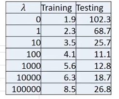
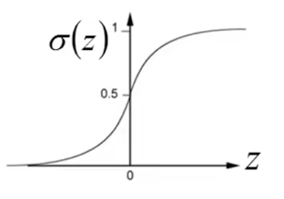

# regression
## linear regression
使用$\delta$ 函数实现特征选择
$$
\hat{y} = \sum_{i=1}^{n}\delta(x_i)w_i+b_i
$$
## regularization
表述我们要找的function参数值越接近0越好  
$$
L(y,\hat{y}) = \frac{1}{n}\sum_{i=1}^{n}(y_i-\hat{y}_i)^2 + \lambda\sum_{i=1}^{n}w_i^2
$$  

## loss
均方误差(MSE)  
$$
L(y,\hat{y}) = \frac{1}{n}\sum_{i=1}^{n}(y_i-\hat{y}_i)^2
$$

### learning rate
hyperparameter $\eta$  
$$
\hat{y}^{(t+1)} = \hat{y}^{(t)} - \eta \frac{\partial L(y,\hat{y})}{\partial \hat{y}}
$$

## optimization

### gradient descent
$$
\hat{y}^{(t+1)} = \hat{y}^{(t)} - \eta \frac{\partial L(y,\hat{y})}{\partial \hat{y}}
$$
#### backword propagation
$$
\frac{\partial L(y,\hat{y})}{\partial \hat{y}} = \frac{\partial L(y,\hat{y})}{\partial z} \frac{\partial z}{\partial \hat{y}}
$$

# Classification
## binary
### Probabilistic generative model(统计模型)

$$
\begin{aligned}
P(y=1|x) &= \frac{P(x|y=1)P(y=1)}{P(x)}\\
&= \frac{P(x|y=1)P(y=1)}{P(x|y=1)P(y=1)+P(x|y=0)P(y=0)}\\
&=\frac{1}{1+e^{-z}},z=\ln\frac{P(x|y=1)P(y=1)}{P(x|y=0)P(y=0)}
\end{aligned}
$$
  
当共用协相关系数矩阵时,不限于Guussian分布，其他许多分布也能化简成这样的结果  
$$
z = w^Tx+b\\
P(y=1|x) = \sigma(w^Tx+b)
$$
所以sigmoid函数的输出的是posterior probability

- 生成模型的好处
  - 假设概率分布，需要的训练数据更少
  - 假设概率分布，对噪声更具鲁棒性
  - 先验和类别相关的概率可以从不同来源估计(important):可以更好的获得先验概率

### naive Bayes Classifier

### logistic regression(Discriminative model)

#### cross entropy
$$
L(y,\hat{y}) = -\sum_{i=1}^{n}y_i\ln(\hat{y}_i)+(1-y_i)\ln(1-\hat{y}_i)
$$
## multi-class

# Deep learning

## softmax
$$
softmax(z_i) = \frac{e^{z_i}}{\sum_{j=1}^{n}e^{z_j}}
$$

## cross entropy loss

$$
L(y,\hat{y}) = -\sum_{i=1}^{n}y_i\log(\hat{y}_i)
$$

