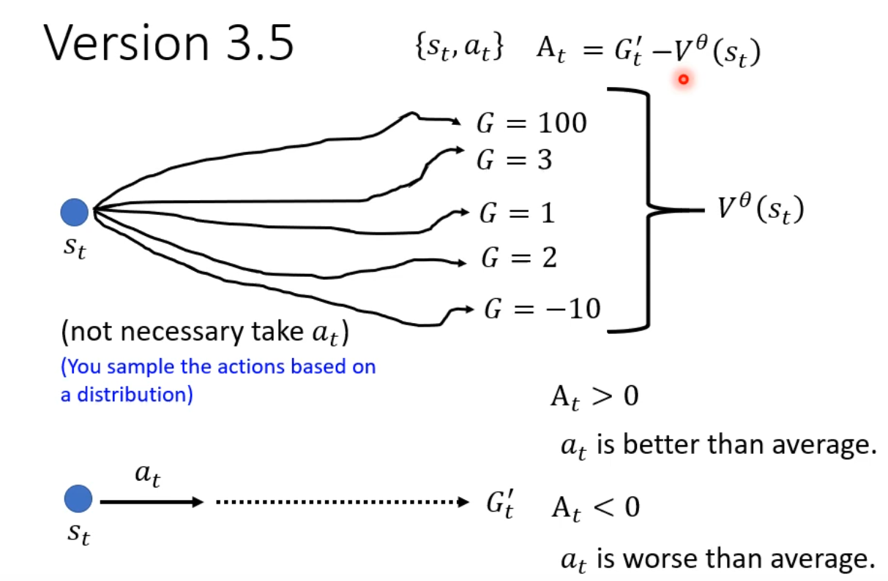

# Reinforcement Learning
## RL loss  
reward $r_t$ is the immediate reward at time $t$, and $A_t$ is the advantage at time $t$.
## policy gradient
### version 0
reward delay and short sight problem
### version 1
cumulative reward
$A_k=\sum_{i=k}^{n}r_i$
### version 2
$A_k=r_k+\gamma r_{k+1}+\gamma^2 r_{k+2}+\cdots=\sum_{i=k}^{n}\gamma^{i-k}r_i$  
where $\gamma\in[0,1)$ is the discount factor
### version 3
Good or bad reward is relative  
$A_k=G'_k-b$
### version 3.5
$A_k=G'_k-V^\theta(s_k)$

### version 4 advantage actor-critic (A2C)
$$
A_k=r_k+V^\theta(s_{k+1})-V^\theta(s_k)
$$

> tips:the parameters of actor and critic can be shared.
## critic
given actor $\theta$ a value function $V^\theta(s)$, which is the expected return from state $s$

how to train critic?
1. Monte Carlo method

2. Temporal Difference (TD) learning 
    $$
    V^\theta(s_t)-\gamma V^\theta(s_{t+1}) \rightarrow r_t
    $$