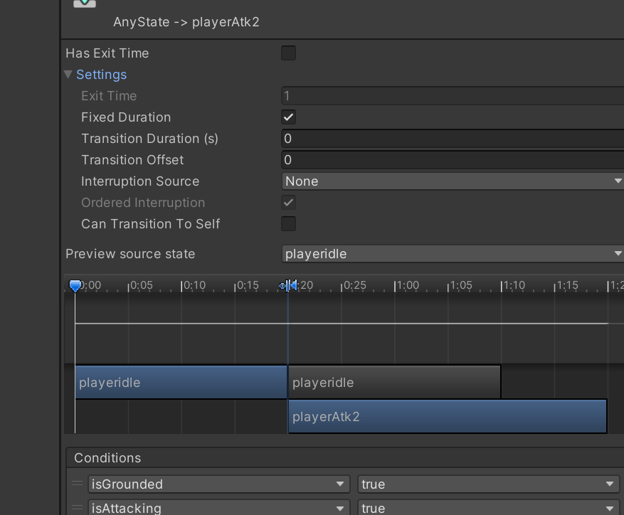

## 程序部分
start函数

update函数

### input monitor
#### Getkey
#### GetButton

### sprite 处理
TODO sprite 的pivot调整和rotation
BUG
filp
#### center of object match 

### timer 时间控制

### Fix endless jump
finish
#### gizmo
Gizmo是Unity编辑器中用于可视化和调试的辅助工具，它允许开发者在Scene视图中绘制简单的几何形状、图标、文本和其他图形元素。Gizmos的主要作用包括：

可视化：Gizmos可以帮助开发者在Scene视图中直观地看到游戏对象的位置、方向和尺寸，这对于调试和调整游戏对象的布局非常有用。

调试：开发者可以使用Gizmos来绘制射线、线段、球体等，以检查物理射线检测、碰撞检测等逻辑是否按预期工作。

辅助设计：在设计游戏场景时，Gizmos可以用来标记关键位置，如敌人的巡逻路径、摄像机的视野范围等。

性能优化：通过Gizmos，开发者可以快速识别和调整那些可能影响性能的游戏对象，如不必要的渲染对象或过多的碰撞体。

教育和演示：在教学或演示中，Gizmos可以用来解释游戏机制，如力的作用、光线传播等。

自定义编辑器工具：开发者可以创建自定义的Gizmos来增强Unity编辑器的功能，使其更适合自己的开发流程。
### animator 状态机state machine
